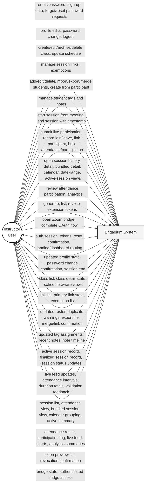

# Engagium Context DFD

**Notation:** Gane-Sarson style, represented with SSADM-friendly Mermaid shapes for ease of diagram generation.

## Scope

The context diagram shows the single external entity used by the current system: **Instructor (User)**.

## Instructor Input / Output Catalogue

| Instructor input | System output |
|---|---|
| Email/password sign-in | Authenticated dashboard session, JWT access token, refresh token |
| Sign-up data | Account creation confirmation and authenticated entry |
| Forgot-password email request | Password reset email / reset request confirmation |
| Reset-password submission | Password reset success or validation error |
| Profile edits | Updated profile state |
| Password change | Password change confirmation |
| Logout | Session termination and return to landing page |
| Create/edit/archive/delete class | Updated class list and class detail state |
| Update class schedule | Schedule-aware class listing and session grouping output |
| Manage session links | Updated meeting link list and primary-link state |
| Manage exemptions | Updated exemption list |
| Add/edit/delete/import/export/merge students | Updated roster, duplicate warnings, export file, merge result |
| Create student from participant | New student record or linked student confirmation |
| Manage student tags | Updated tag definitions and assignments |
| Manage student notes | Updated note timeline and recent-note list |
| Start session from meeting | Active session record and live dashboard visibility |
| End session with timestamp | Finalized session record and ended-session confirmation |
| Submit live participation events | Live feed updates and persisted participation entries |
| Record participant join/leave | Attendance interval updates and duration totals |
| Link participant to student | Matched roster linkage or manual link confirmation |
| Submit bulk attendance or participation | Stored bulk records and validation feedback |
| Open session history / detail / bundled detail | Session list, attendance view, bundled session view |
| Open calendar / date-range / active-session views | Calendar grouping, active-session summary, filtered history |
| Review attendance and participation | Attendance roster, participation log, live feed entries |
| Review analytics | Class analytics charts and student analytics output |
| Generate / list / revoke extension tokens | Token preview list and revocation confirmation |
| Open Zoom bridge / complete OAuth flow | Zoom bridge state and authenticated bridge access |

## Context Diagram

