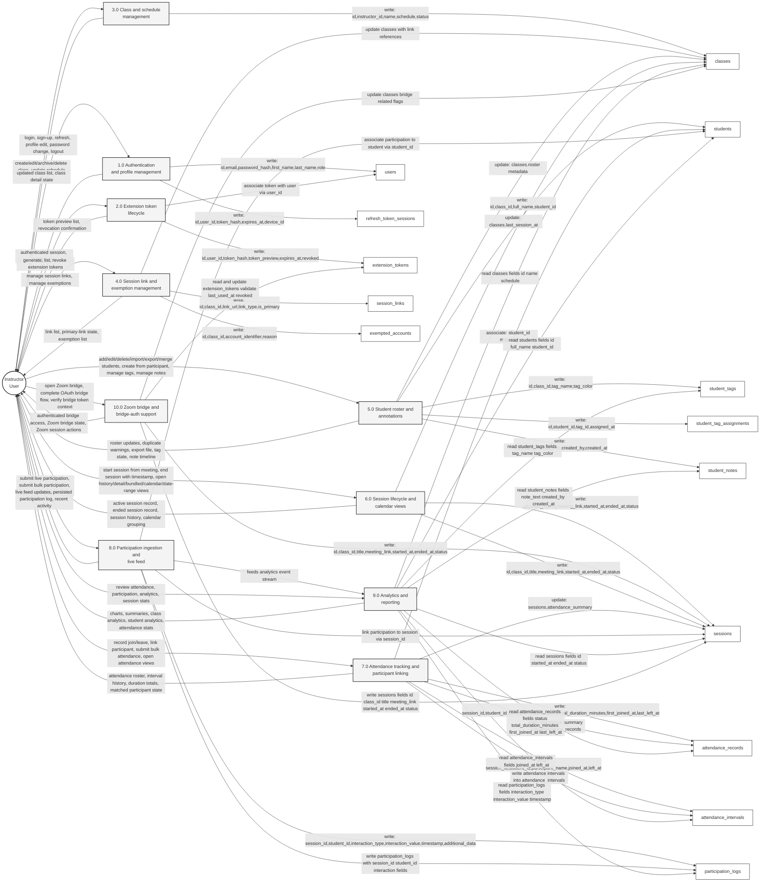

# Engagium Level 1 DFD

**Notation:** Gane-Sarson style, represented with SSADM-friendly Mermaid shapes for ease of diagram generation.

## Process and Data-Store Mapping

| Process | Reads | Writes | Main instructor inputs | Main outputs |
|---|---|---|---|---|
| 1.0 Authentication and profile management | `users`, `refresh_token_sessions` | `users`, `refresh_token_sessions` | login, sign-up, refresh, profile edit, password change, logout | authenticated session, profile state, password-change confirmation |
| 2.0 Extension token lifecycle | `extension_tokens`, `users` | `extension_tokens` | generate token, list tokens, revoke token, revoke all | token preview list, revocation confirmation |
| 3.0 Class and schedule management | `classes` | `classes` | create/edit/archive/delete class, update schedule | class list, class detail, schedule-aware views |
| 4.0 Session link and exemption management | `session_links`, `exempted_accounts`, `classes` | `session_links`, `exempted_accounts` | manage meeting links, manage exemptions | updated link list, primary-link state, exemption list |
| 5.0 Student roster and annotations | `students`, `student_tags`, `student_tag_assignments`, `student_notes`, `classes` | `students`, `student_tags`, `student_tag_assignments`, `student_notes` | add/edit/delete/import/export/merge students, create from participant, manage tags, manage notes | roster updates, duplicate warnings, export file, link confirmation, tag state, note timeline |
| 6.0 Session lifecycle and calendar views | `sessions`, `classes` | `sessions` | start session from meeting, end session with timestamp, open active/history/detail/bundled/calendar/date-range views | active session record, ended session record, session history, calendar grouping |
| 7.0 Attendance tracking and participant linking | `attendance_records`, `attendance_intervals`, `sessions`, `students` | `attendance_records`, `attendance_intervals` | record join/leave, link participant to student, submit bulk attendance, open attendance views | attendance roster, interval history, duration totals, matched participant state |
| 8.0 Participation ingestion and live feed | `participation_logs`, `sessions`, `students` | `participation_logs` | submit live participation, submit bulk participation, open participation views | live feed updates, persisted participation log, recent activity |
| 9.0 Analytics and reporting | `classes`, `students`, `sessions`, `attendance_records`, `attendance_intervals`, `participation_logs`, `student_tags`, `student_notes` | none | review attendance, participation, analytics, session stats | charts, summaries, class analytics, student analytics, attendance stats |
| 10.0 Zoom bridge and bridge-auth support | `classes`, `sessions`, `extension_tokens` | `sessions`, `extension_tokens` | open Zoom bridge, complete OAuth bridge flow, verify bridge token context | authenticated bridge access, Zoom bridge state, Zoom session actions |

## Level 1 Diagram

### Data store field summaries (highlights)

- `users`: id, email, password_hash, first_name, last_name, role, refresh_token
- `refresh_token_sessions`: id, user_id, token_hash, expires_at, device_id
- `extension_tokens`: id, user_id, token_hash, token_preview, expires_at, revoked
- `classes`: id, instructor_id, name, schedule (jsonb), status
- `session_links`: id, class_id, link_url, link_type, is_primary
- `exempted_accounts`: id, class_id, account_identifier, reason
- `students`: id, class_id, full_name, student_id, deleted_at
- `student_tags`: id, class_id, tag_name, tag_color
- `student_tag_assignments`: id, student_id, tag_id, assigned_at
- `student_notes`: id, student_id, note_text, created_by, created_at
- `sessions`: id, class_id, title, meeting_link, started_at, ended_at, status
- `attendance_records`: id, session_id, student_id, participant_name, status, total_duration_minutes, first_joined_at, last_left_at
- `attendance_intervals`: id, session_id, student_id, participant_name, joined_at, left_at
- `participation_logs`: id, session_id, student_id, interaction_type, interaction_value, timestamp, additional_data

