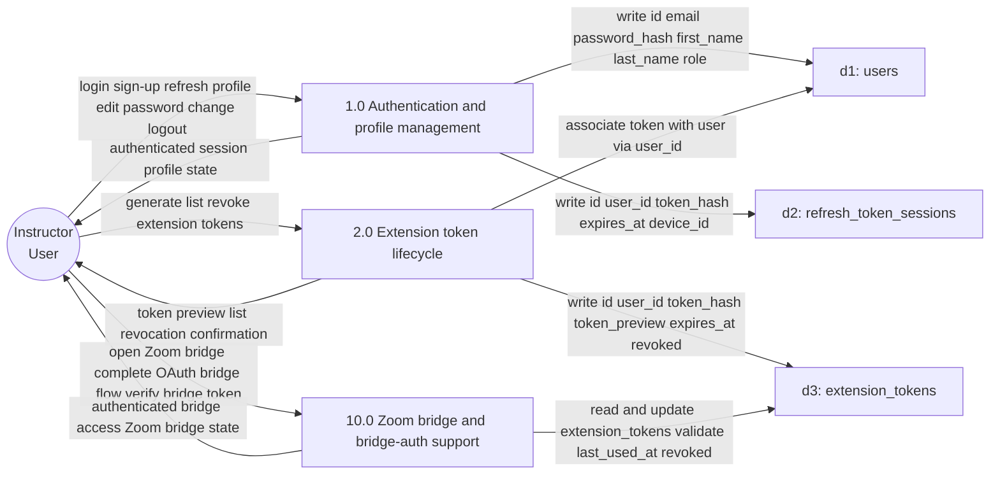
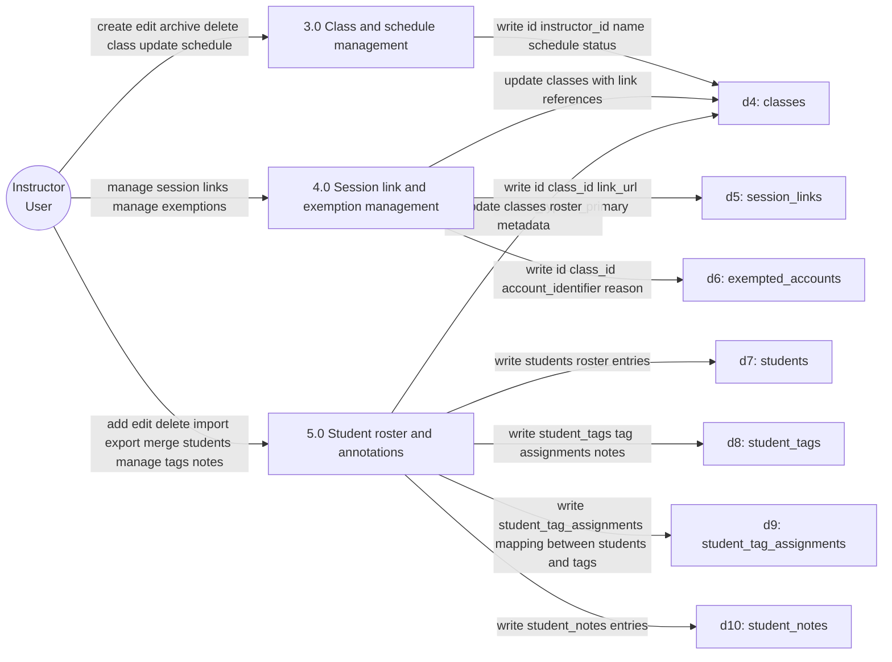
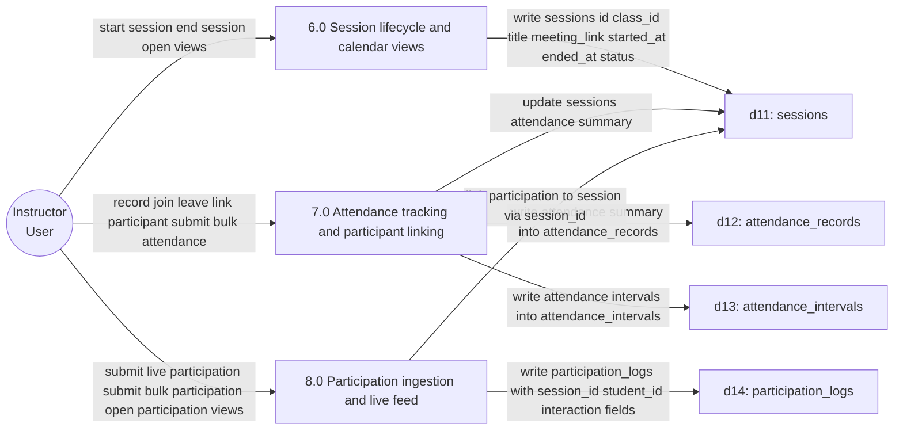
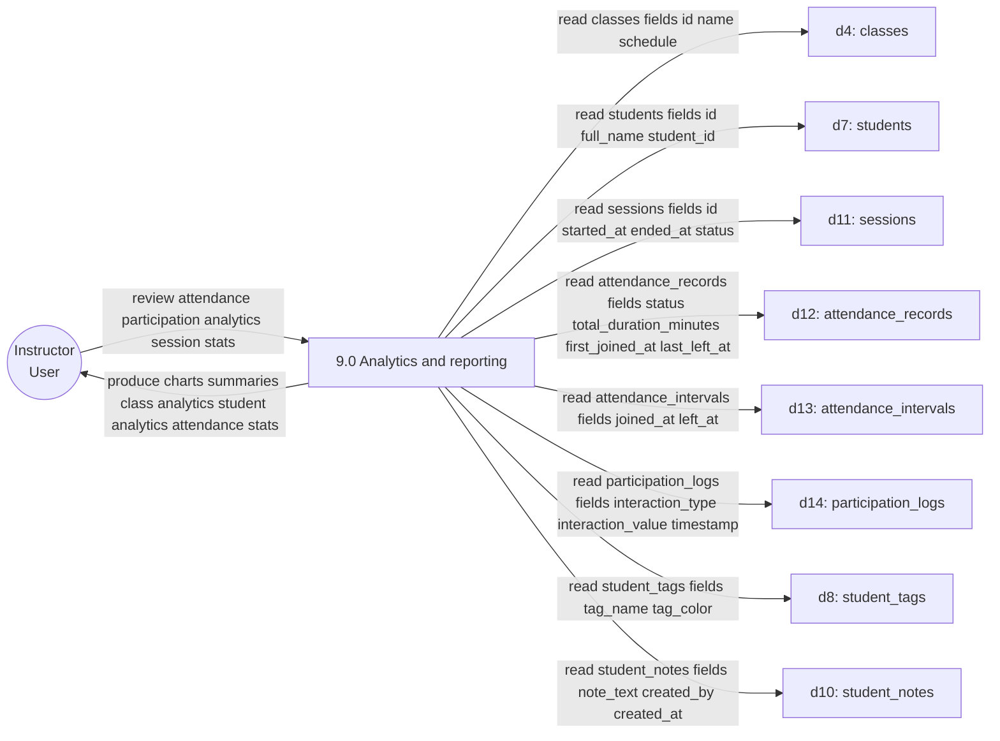

# Engagium Level 1 DFD — Modular View

This document splits the Level 1 DFD into four printable modules for clearer presentation on Letter-sized pages.

## Module A — User & Security

_Stores referenced:_ `d1` `d2` `d3`

---

## Module B — Academic Management

_Stores referenced:_ `d4` `d5` `d6` `d7` `d8` `d9` `d10`

---

## Module C — Session & Participation

_Stores referenced:_ `d11` `d12` `d13` `d14`

---

## Module D — Intelligence (Analytics & Reporting)

_Stores referenced by Analytics:_ `d4`, `d7`, `d8`, `d10`, `d11`, `d12`, `d13`, `d14`

---

Notes:
- Each module is intended to fit on a single Letter-sized page when rendered. You can shorten arrow labels if you prefer more whitespace for node labels.
- These module diagrams preserve the same naming and store references as the consolidated Level 1 DFD.
