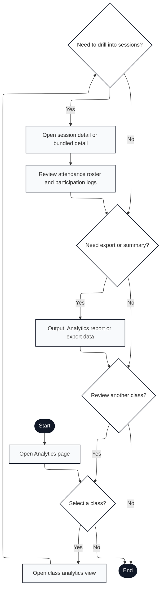

# Engagium User Program Flowchart

## A.3.5 Analytics and Review Flow

Notation: Mermaid nodes labeled with `Input:`, `Output:`, and `Document:` are used to approximate ISO 5807 shapes that Mermaid does not render directly.

---

## Flow Description

1. **Start**: User navigates to Analytics from dashboard or session context
2. **Open Analytics Page**: Display analytics hub with class selector and summary metrics
3. **Select a Class?**: User decision
   - **Yes** → Proceed to class-level analytics
   - **No** → Exit analytics (line 19)
4. **Open Class Analytics View**: Display class-level metrics with attendance trends, participation patterns, and session summary
5. **Need to Drill Into Sessions?**: User decision for detail level
   - **Yes** → Open detailed session views
   - **No** → Skip to export decision
6. **Open Session Detail or Bundled Detail**: Display individual session records or bundled session view (multiple sessions merged)
7. **Review Attendance Roster and Participation Logs**: Display detailed attendance records and engagement activity for selected session(s)
8. **Need Export or Summary?**: User decision
   - **Yes** → Generate export document
   - **No** → Check for additional class review
9. **Output: Analytics Report or Export Data**: Generate and output CSV/PDF report with attendance and participation data
10. **Review Another Class?**: User decision
    - **Yes** → Return to class selection
    - **No** → Exit analytics
11. **End**: Analytics review complete

---

## Key Features Mapped

- **Class-level aggregation**: Summary metrics and trends across all sessions in class (line 4)
- **Drill-down hierarchy**: Optional session-level detail view from class summary (lines 5-7)
- **Export generation**: On-demand report generation with attendance and participation (line 9)
- **Multi-class browsing**: Loop back to class selector for comparative analysis (line 10)