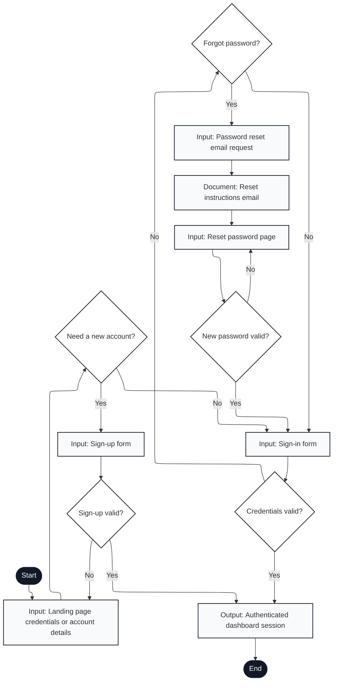

# Engagium User Program Flowchart

## A.3.1 Auth and Recovery Flow

Notation: Mermaid nodes labeled with `Input:`, `Output:`, and `Document:` are used to approximate ISO 5807 shapes that Mermaid does not render directly.

---

## Flow Description

1. **Start**: User navigates to Engagium login page
2. **Landing Page**: Display login/sign-up interface with credential input fields
3. **Need a New Account?**: User decision point
   - **Yes** → Proceed to sign-up form
   - **No** → Proceed to sign-in form
4. **Sign-up Form**: Input email, password, first/last name
5. **Sign-up Valid?**: Backend validates new account credentials
   - **Yes** → Create user record, authenticate session
   - **No** → Return to landing page with error message
6. **Sign-in Form**: Input email and password
7. **Credentials Valid?**: Backend validates credentials against stored hash
   - **Yes** → Authenticate session, proceed to dashboard
   - **No** → Prompt password recovery or retry
8. **Forgot Password?**: User decision point
   - **Yes** → Request password reset
   - **No** → Return to sign-in form to retry
9. **Password Reset Email Request**: Submit email address to receive reset link
10. **Reset Instructions Email**: Output email document with secure reset link
11. **Reset Password Page**: Enter new password via secure token-validated form
12. **New Password Valid?**: Backend validates new password criteria
    - **Yes** → Save new password, return to sign-in
    - **No** → Return to reset page with validation feedback
13. **Authenticated Dashboard Session**: Output authenticated session token and redirect to dashboard
14. **End**: Login flow complete

---

## Key Features Mapped

- **Account creation**: New professor sign-up with validation (lines 3-5)
- **Credential validation**: Secure password verification with error handling (lines 6-7)
- **Password recovery**: Email-based reset flow with token security (lines 8-12)
- **Session authentication**: JWT token generation and storage on successful login (line 13)