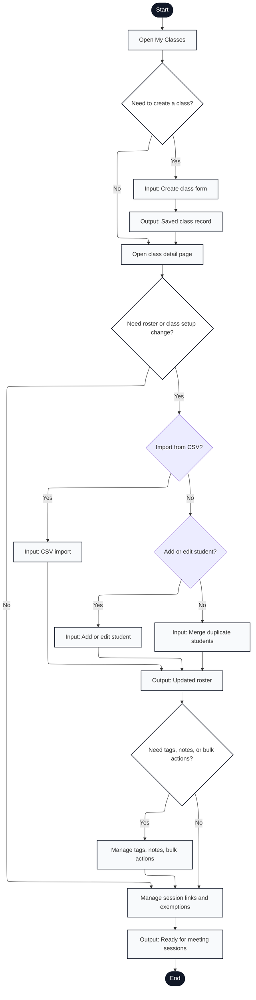

# Engagium User Program Flowchart

## A.3.3 Class and Roster Management Flow

Notation: Mermaid nodes labeled with `Input:`, `Output:`, and `Document:` are used to approximate ISO 5807 shapes that Mermaid does not render directly.

---

## Flow Description

1. **Start**: User navigates to class management from dashboard
2. **Open My Classes**: Display list of professor's classes with options to create, edit, or archive
3. **Need to Create a Class?**: User decision
   - **Yes** → Class creation form
   - **No** → Skip to existing class detail
4. **Create Class Form**: Input class code, name, semester, section, institution
5. **Saved Class Record**: Output class record to database and receive class ID
6. **Open Class Detail Page**: Display class settings, roster, session history, links, and exemptions
7. **Need Roster or Class Setup Change?**: User decision
   - **Yes** → Proceed to roster import/edit/merge options
   - **No** → Skip to student organization
8. **Import from CSV?**: User choice for roster population method
   - **Yes** → CSV import workflow
   - **No** → Present manual add/edit/merge options
9. **CSV Import**: Input and parse CSV file with student names/IDs
10. **Add or Edit Student?**: User choice if not importing
    - **Yes** → Manual student add/edit form
    - **No** → Proceed to merge duplicates
11. **Input: Add or Edit Student**: Form to add individual student or update existing student record
12. **Input: Merge Duplicate Students**: Select duplicate student records and merge identities
13. **Output: Updated Roster**: Display new or modified roster with all students
14. **Need Tags, Notes, or Bulk Actions?**: User decision for advanced roster organization
    - **Yes** → Student organization interface
    - **No** → Skip to session link management
15. **Manage Tags, Notes, Bulk Actions**: Assign tags, add notes, bulk operations on student records
16. **Manage Session Links and Exemptions**: Link meeting URLs to automatic class detection, mark exempt students
17. **Output: Ready for Meeting Sessions**: Class and roster fully configured for attendance tracking
18. **End**: Class setup complete

---

## Key Features Mapped

- **Class creation**: New class form with semester/section info (lines 3-5)
- **Roster import hierarchy**: Import (Yes) vs. manual entry chain (No) (lines 8-12)
- **Student organization**: Tags, notes, and bulk operations for roster management (line 15)
- **Session link mapping**: Link meeting URLs for automatic detection in extension (line 16)
- **Exemption handling**: Mark students exempt from attendance tracking (line 16)