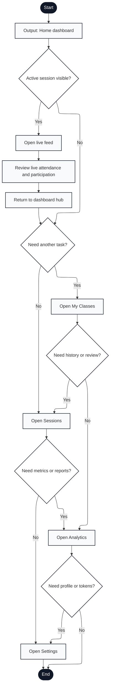

# Engagium User Program Flowchart

## A.3.2 Dashboard Hub and Navigation Flow

Notation: Mermaid nodes labeled with `Input:`, `Output:`, and `Document:` are used to approximate ISO 5807 shapes that Mermaid does not render directly.

---

## Flow Description

1. **Start**: User logs in or returns to dashboard
2. **Home Dashboard**: Output dashboard hub showing overview cards, quick actions, and navigation
3. **Active Session Visible?**: Check if a meeting is currently in progress
   - **Yes** → Display live session card with quick access to live feed
   - **No** → Show historical options
4. **Open Live Feed**: Display real-time attendance and participation monitoring interface (if active session)
5. **Review Live Attendance and Participation**: Monitor current meeting with live participant updates
6. **Return to Dashboard Hub**: Exit live feed view
7. **Need Another Task?**: User decision at hub (navigation choice)
   - **Yes** → Present area selection menu
   - **No** → Begin task selection chain
8. **Open My Classes**: Navigate to class management interface
9. **Need History or Review?**: User decision
   - **Yes** → Jump to Sessions area
   - **No** → Continue to Analytics
10. **Open Sessions**: Navigate to session history and session detail views
11. **Need Metrics or Reports?**: User decision
    - **Yes** → Jump to Analytics area
    - **No** → Continue to Settings
12. **Open Analytics**: Navigate to analytics dashboard with class-level metrics
13. **Need Profile or Tokens?**: User decision
    - **Yes** → Jump to Settings area
    - **No** → End flow
14. **Open Settings**: Navigate to profile, password, and extension token management
15. **End**: User exits dashboard or closes session

---

## Key Features Mapped

- **Hub navigation**: Central dashboard with links to all major features (lines 2-14)
- **Active session quick access**: Live feed shortcut when meeting in progress (lines 3-5)
- **Sequential task navigation**: Chained decision points for browsing multiple areas (lines 8-13)
- **Non-blocking flow**: User can exit from any point or return to hub (line 6)