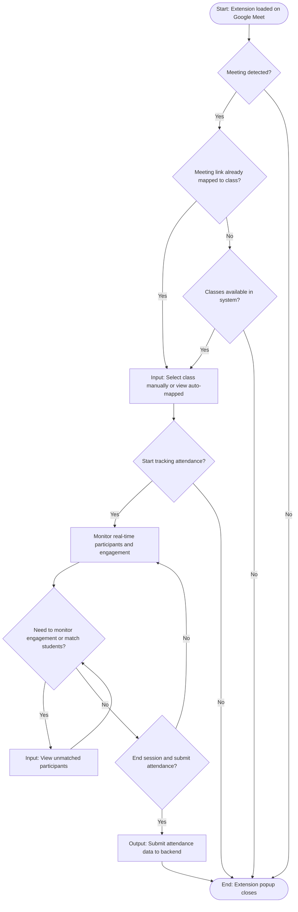

# User Program Flowchart: Chrome Extension (A.3.8)

**Concern**: Chrome extension user journey for Google Meet attendance tracking

**Abstraction Level**: Screen/State-level (one node = one visible interface state or user action)

**Mermaid ISO 5807 Approximation**:
- Rectangles = Process/Action (state)
- Diamonds = Decision (binary Yes/No only)
- Parallelograms/labels = Input/Output annotations
- Arrows labeled Yes→right, No→down

---

## Flowchart

---

## Flow Description

1. **Start**: Extension activates when professor opens Google Meet (manifest.json content script triggers)
2. **Meeting Detected?**: Extension's content script detects Google Meet DOM
   - **Yes** → Check if meeting was previously tracked
   - **No** → Wait or close extension (stop)
3. **Meeting Link Already Mapped?**: Check if this meeting URL was saved from previous session
   - **Yes** → Proceed to class selection with pre-selected class
   - **No** → Check for available classes
4. **Classes Available?**: Query backend for professor's active classes
   - **Yes** → Proceed to manual selection
   - **No** → Error message, dismiss extension (stop)
5. **Select Class**: Display class selector UI (auto-populated if mapped, manual dropdown if not)
   - Input: Professor selects class from dropdown or accepts auto-mapped suggestion
6. **Start Tracking?**: User clicks "Start Tracking" button
   - **Yes** → Create session, show monitoring interface
   - **No** → Dismiss meeting detection UI (stop)
7. **Session Monitor**: Display real-time tracking interface with:
   - Session duration timer
   - Total participant count
   - Matched students count
   - Unmatched/pending students list
8. **Need to Monitor Engagement?**: During active session, professor can check participants or match students
   - **Yes** → View unmatched participants, manually verify matches
   - **No** → Proceed to end session
9. **Manual Match Students** (loop): Professor can view unmatched participants and verify identity matches
   - Returns to engagement check until ready to end
10. **End Session?**: User clicks "End Tracking" button when meeting ends
    - **Yes** → Submit attendance data to backend
    - **No** → Continue monitoring (loop back to engagement check)
11. **Submit Data**: Output attendance records with matched/unmatched status to backend
12. **Stop**: Extension popup closes or loses focus

---

## Key Features Mapped

- **Auto-mapping**: Meeting links remembered from previous sessions (lines 3-4)
- **Real-time sync**: Participants join/leave updates during session (line 8)
- **Unmatched handling**: Students without class roster matches viewable (line 9)
- **Error handling**: Graceful stop when no classes or meeting detection fails (lines 3, 6)
- **Session persistence**: Backend synchronization on end session (line 11)

