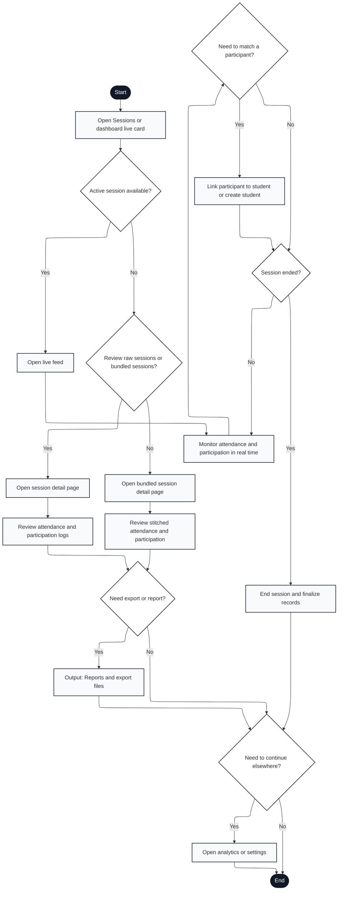

# Engagium User Program Flowchart

## A.3.4 Session Monitoring and History Flow

Notation: Mermaid nodes labeled with `Input:`, `Output:`, and `Document:` are used to approximate ISO 5807 shapes that Mermaid does not render directly.

---

## Flow Description

1. **Start**: User accesses session monitoring from dashboard or active live card
2. **Open Sessions or Dashboard Live Card**: Display session hub with active/past session list
3. **Active Session Available?**: Check if a meeting is currently in progress
   - **Yes** → Jump to live feed
   - **No** → Present history options
4. **Open Live Feed**: Display real-time monitoring interface with live participant updates (during active session)
5. **Monitor Attendance and Participation in Real Time**: Display current attendees, join/leave events, chat, reactions, hand raises, mic toggles
6. **Need to Match a Participant?**: User decision during session
   - **Yes** → Manual participant matching interface
   - **No** → Check if session has ended
7. **Link Participant to Student or Create Student**: Resolve unmatched participant names to student roster or create new student record
8. **Session Ended?**: Check if meeting is still active
   - **Yes** → Proceed to close session
   - **No** → Loop back to live monitoring (line 5)
9. **Review Raw Sessions or Bundled Sessions?**: User choice for history view
   - **Yes** → Raw session detail with individual sessions
   - **No** → Bundled view with stitched attendance
10. **Open Session Detail Page**: Display single session with attendance roster and participation logs
11. **Open Bundled Session Detail Page**: Display merged view across multiple sessions (e.g., all sessions from one class in a day)
12. **Review Attendance and Participation Logs**: Display detailed attendance status and engagement activity from raw session
13. **Review Stitched Attendance and Participation**: Display merged attendance and engagement from bundled sessions
14. **Need Export or Report?**: User decision
    - **Yes** → Generate and download export
    - **No** → Check for next action
15. **End Session and Finalize Records**: Close active session, calculate final attendance, submit data
16. **Output: Reports and Export Files**: Generate CSV/PDF exports with attendance records
17. **Need to Continue Elsewhere?**: User decision
    - **Yes** → Jump to Analytics or Settings
    - **No** → Exit
18. **Open Analytics or Settings**: Navigate to other areas from session context
19. **End**: Session monitoring complete

---

## Key Features Mapped

- **Live monitoring**: Real-time participant tracking with engagement events (lines 4-8)
- **Manual matching**: Link unmatched participants to roster during session (line 7)
- **Session history**: Raw vs. bundled views for historical analysis (lines 9-13)
- **Export workflow**: Generate reports on demand (lines 14, 16)
- **Flexible navigation**: Can exit to analytics or settings without re-entering main flow (line 17)