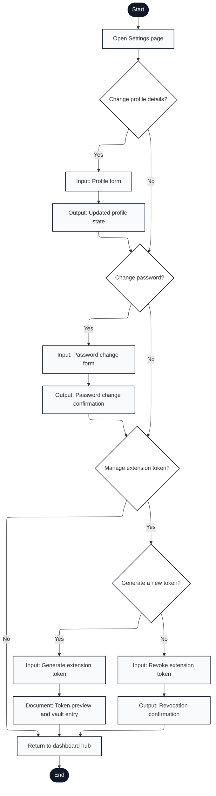

# Engagium User Program Flowchart

## A.3.6 Settings and Extension Token Flow

Notation: Mermaid nodes labeled with `Input:`, `Output:`, and `Document:` are used to approximate ISO 5807 shapes that Mermaid does not render directly.

---

## Flow Description

1. **Start**: User navigates to Settings from dashboard
2. **Open Settings Page**: Display settings interface with tabs/sections for profile, password, and extension tokens
3. **Change Profile Details?**: User decision
   - **Yes** → Open profile edit form
   - **No** → Skip to password change
4. **Profile Form**: Input form for name, email, institution, contact information
5. **Output: Updated Profile State**: Save profile changes to database and display confirmation
6. **Change Password?**: User decision
   - **Yes** → Open password change form
   - **No** → Skip to token management
7. **Password Change Form**: Input current password and new password with confirmation
8. **Output: Password Change Confirmation**: Hash and save new password, display success message
9. **Manage Extension Token?**: User decision for extension setup
   - **Yes** → Proceed to token actions
   - **No** → Return to dashboard
10. **Generate a New Token?**: User choice for token action
    - **Yes** → Generate new extension token
    - **No** → Proceed to revoke option
11. **Input: Generate Extension Token**: Create new cryptographic token tied to professor account
12. **Input: Revoke Extension Token**: Invalidate existing token(s) from database
13. **Document: Token Preview and Vault Entry**: Output token one-time display with copy-to-clipboard and vault entry instructions
14. **Output: Revocation Confirmation**: Display confirmation that token(s) have been revoked
15. **Return to Dashboard Hub**: Exit settings and return to main dashboard
16. **End**: Settings configuration complete

---

## Key Features Mapped

- **Profile editing**: Updateable user information (lines 3-5)
- **Password management**: Secure password change with current password verification (lines 6-8)
- **Token generation**: Create new extension auth tokens (line 11)
- **Token revocation**: Invalidate compromised or unused tokens (line 12)
- **One-time token display**: Token shown once for vault/secure storage (line 13)