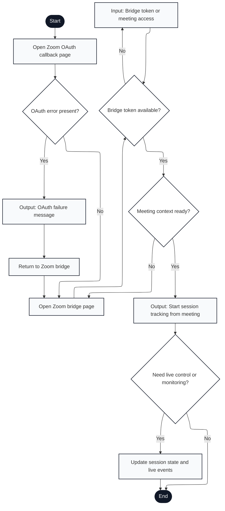

# Engagium User Program Flowchart

## A.3.7 Zoom Bridge and OAuth Flow

Notation: Mermaid nodes labeled with `Input:`, `Output:`, and `Document:` are used to approximate ISO 5807 shapes that Mermaid does not render directly.

---

## Flow Description

1. **Start**: User clicks Zoom OAuth authorization link or redirects from Zoom app
2. **Open Zoom OAuth Callback Page**: Backend receives OAuth code and processes authorization
3. **OAuth Error Present?**: Check for Zoom authorization errors (user denied, invalid scope, etc.)
   - **Yes** → Display error message
   - **No** → Proceed to bridge setup
4. **Output: OAuth Failure Message**: Display error details and link back to bridge
5. **Return to Zoom Bridge**: User clicks link or uses back button
6. **Open Zoom Bridge Page**: Display Zoom bridge interface with token input and meeting context setup
7. **Bridge Token Available?**: Check if bridge token for Zoom meeting context exists in session storage
   - **No** → Prompt for token entry
   - **Yes** → Skip to context readiness check
8. **Input: Bridge Token or Meeting Access**: Paste bridge token from Zoom meeting or enter meeting access code
9. **Meeting Context Ready?**: Check if meeting ID, participant list, and attendee context are available
    - **Yes** → Proceed to start tracking
    - **No** → Return to bridge page for additional input
10. **Output: Start Session Tracking from Meeting**: Create session record linked to Zoom meeting, display tracking interface
11. **Need Live Control or Monitoring?**: User decision
    - **Yes** → Enable live session updates and event processing
    - **No** → End bridge flow
12. **Update Session State and Live Events**: Process Zoom participant events (join/leave), engagement signals, and sync to Engagium database
13. **End**: Zoom bridge flow complete or user disconnects

---

## Key Features Mapped

- **OAuth authorization**: Zoom app integration with permission scope handling (lines 1-4)
- **Error handling**: Graceful error display with recovery path (lines 3-5)
- **Bridge token validation**: Meeting context security via bridge token (lines 7-8)
- **Live event sync**: Real-time Zoom participant and engagement data processing (line 12)
- **Stateful flow**: Token persistence across bridge page interactions (line 7)