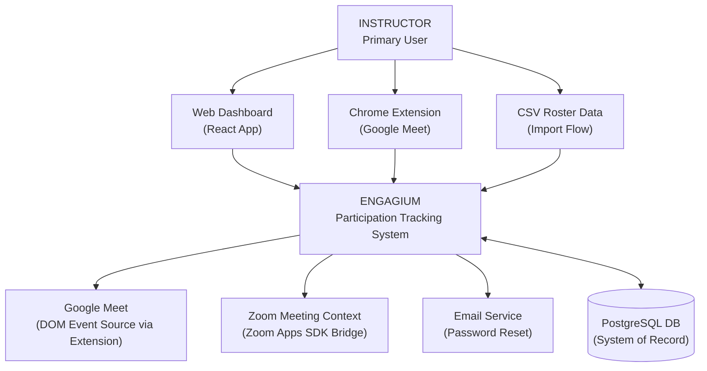
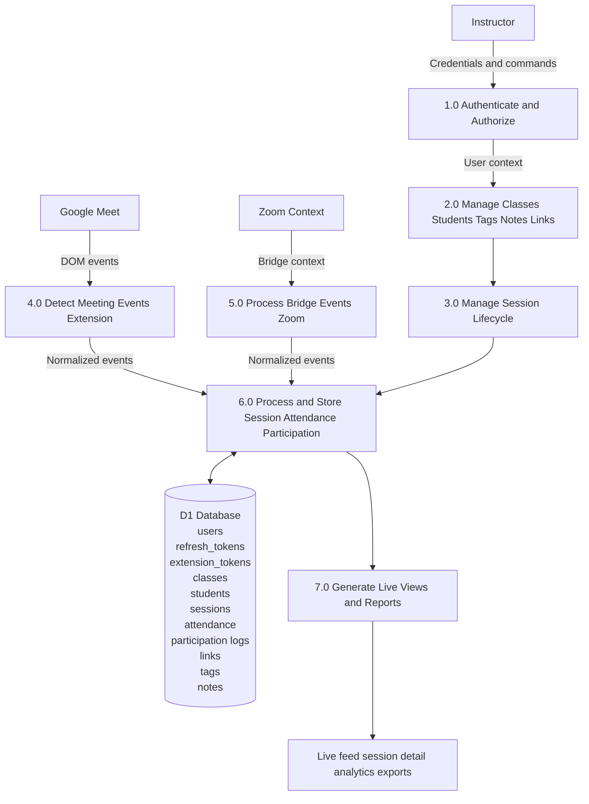
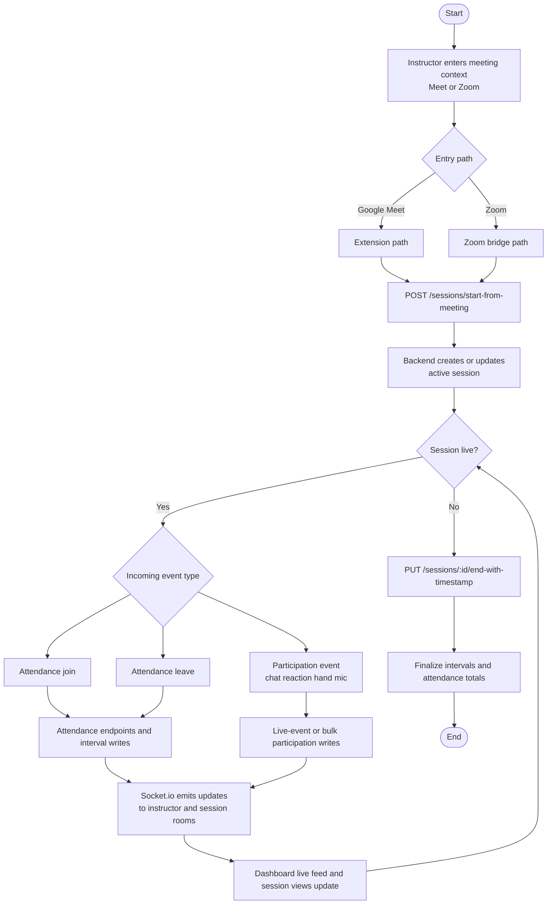
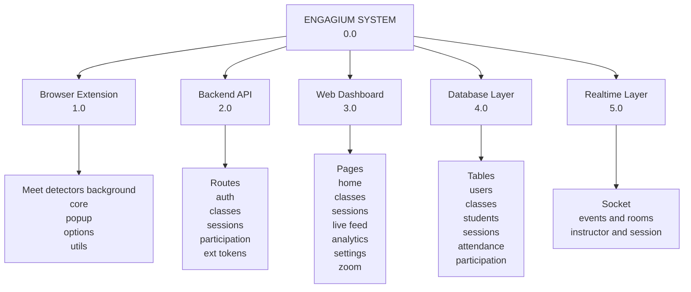
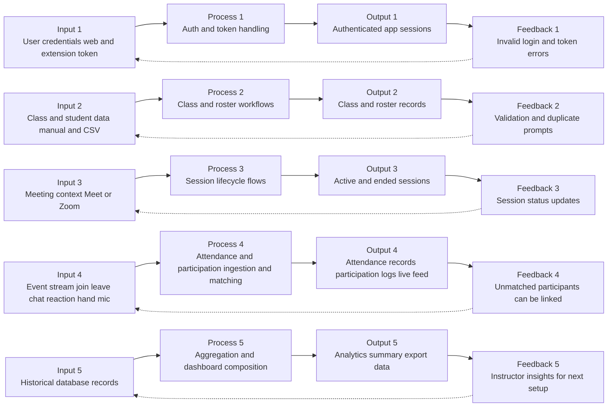
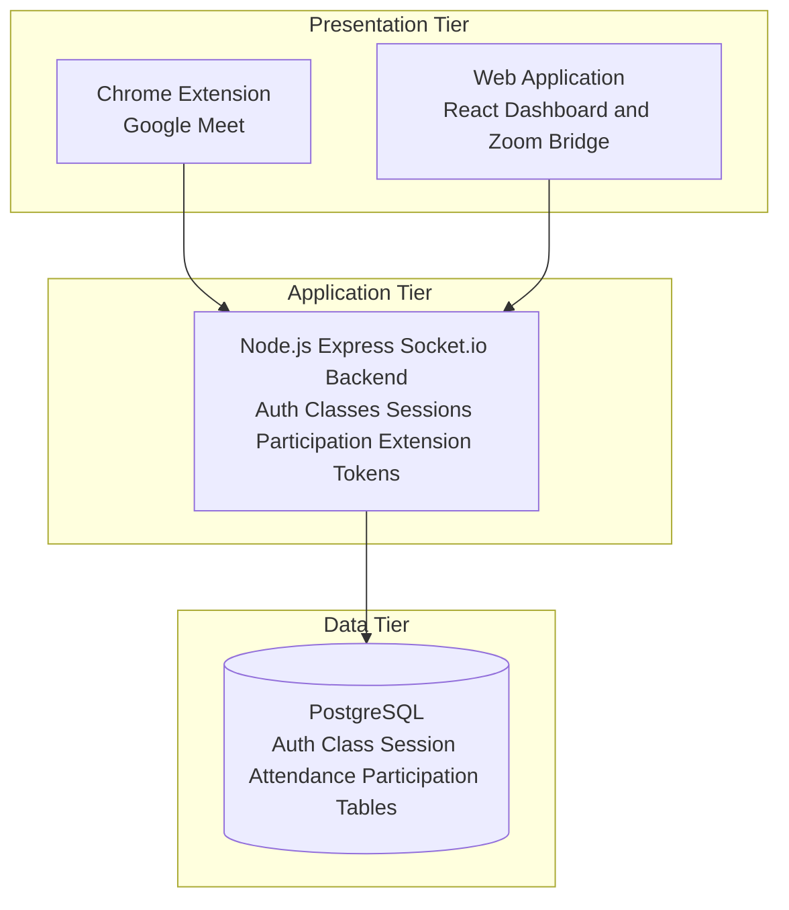
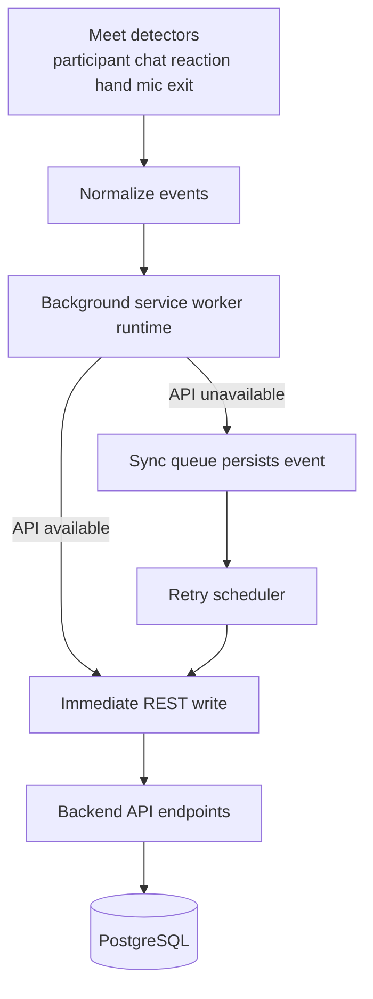
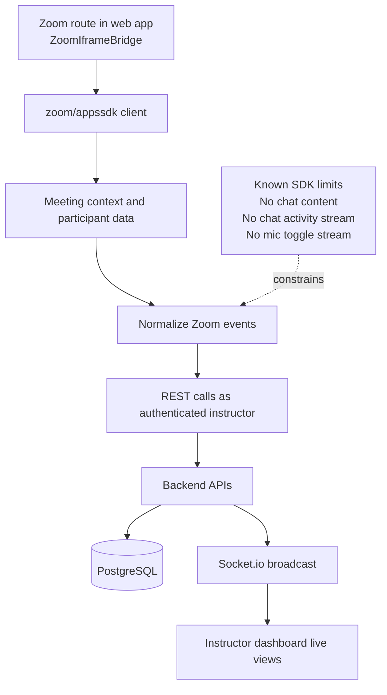
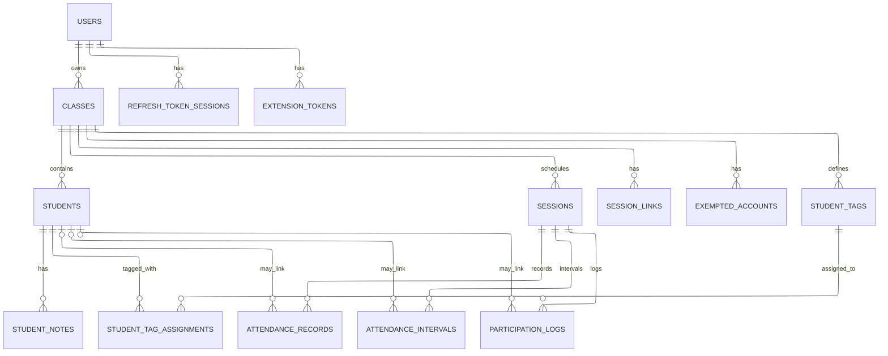
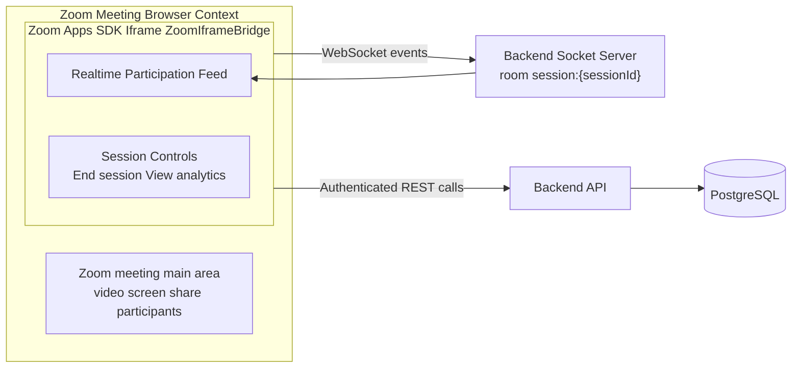

# APPENDIX: DIAGRAMS WITH MERMAID CODE

**Last Updated:** April 22, 2026

This file consolidates the thesis appendix diagrams and provides Mermaid source code for each one.

---

## A.1 Context Diagram

---

## A.2 Level-0 Data Flow Diagram (Exploded Diagram)

---

## A.3 Program Flowchart

---

## A.4 Visual Table of Contents (VTOC) Diagram

---

## A.5 Input-Process-Output (IPO) Diagram (with Feedback)

---

## B.2 System Architecture (3-Tier Model)

---

## B.4 Browser Extension Architecture

---

## B.5 Zoom Bridge Architecture

---

## B.7 Database Schema (ERD + Table Definitions)

---

## D.6 Zoom Bridge (Zoom Apps SDK) Architecture

---

## Notes

1. Mermaid syntax is editable for thesis formatting preferences.
2. Some diagrams are conceptual simplifications of wider appendix discussions.
3. Zoom data-capture limitations shown above follow current documented SDK constraints.
