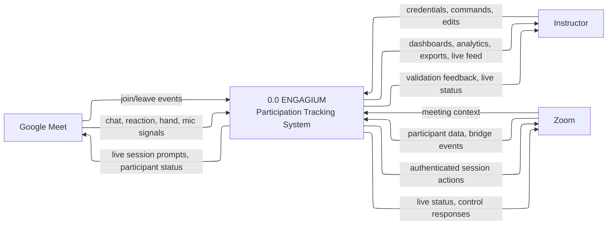
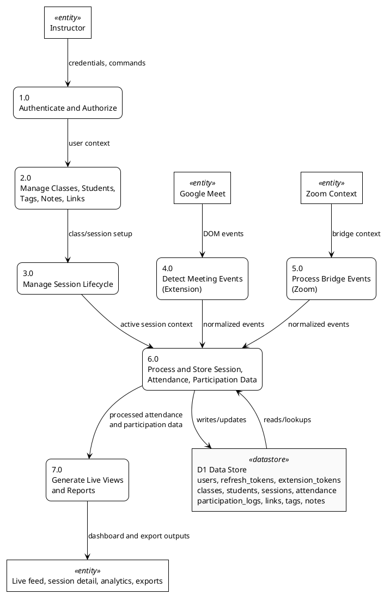
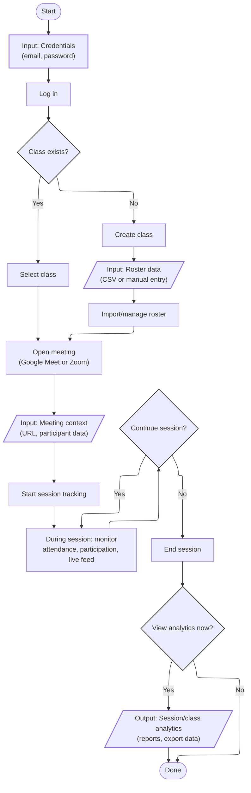
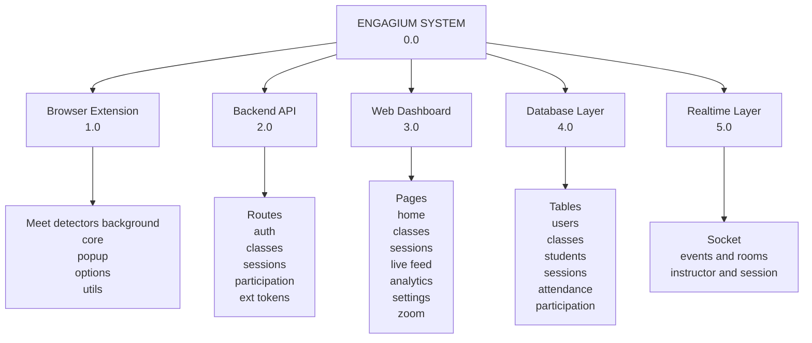
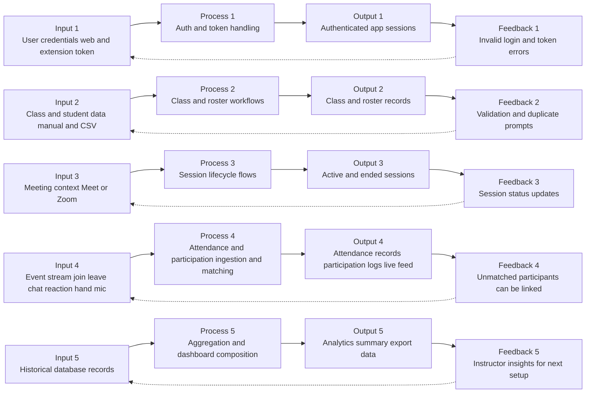
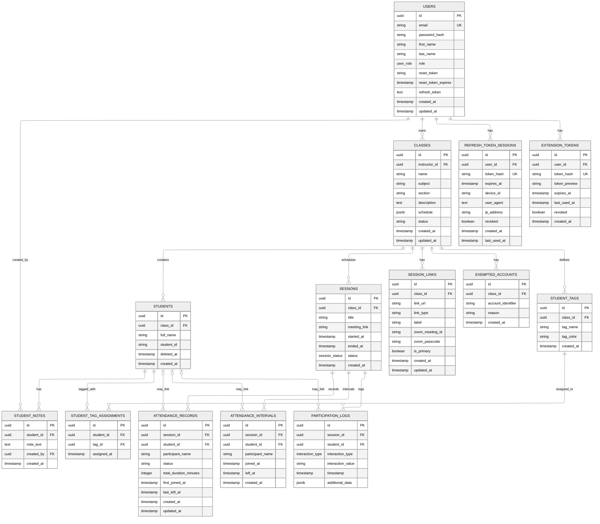
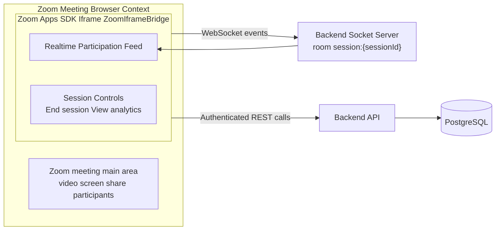

# APPENDIX: DIAGRAMS WITH MERMAID CODE

**Last Updated:** April 22, 2026

This file consolidates the thesis appendix diagrams and provides Mermaid source code for each one.

---

## A.1 Context Diagram

---

## A.2 Level-0 Data Flow Diagram (Exploded Diagram)

---

## A.3 User Decision Tree (ISO 5807 — professor-only)

Notation: Follows ISO-5807 conventions for user-facing flows — decisions are binary (Yes/No) and explicit. See: https://cdn.standards.iteh.ai/samples/11955/1b7dd254a2a54fd7a89d616dc0570e18/ISO-5807-1985.pdf

Note: Engagium is professor-only. There is no student or participant login surface. This tree shows the instructor workflow only.

---

## A.4 Visual Table of Contents (VTOC) Diagram

---

## A.5 Input-Process-Output (IPO) Diagram (with Feedback)

---

## B.2 System Architecture (3-Tier Model)

---

## D.6 Zoom Bridge (Zoom Apps SDK) Architecture

---

## Notes

1. Mermaid syntax is editable for thesis formatting preferences.
2. Some diagrams are conceptual simplifications of wider appendix discussions.
3. Zoom data-capture limitations shown above follow current documented SDK constraints.
