# APPENDIX A
DIAGRAMS AND SYSTEM MODELS

**Last Updated:** April 18, 2026

This appendix presents the current diagrams and system models for the ENGAGIUM implementation in the repository.

---

## A.1 Context Diagram

The context diagram shows the single external entity that revolves within the current system: **Instructor (User)**.

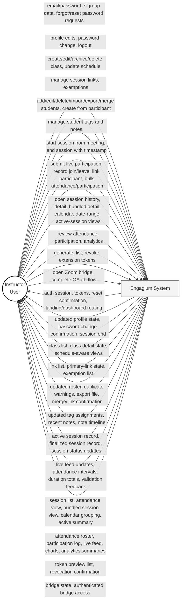

### Input / Output Table

| Instructor input | System output |
|---|---|
| Email/password sign-in | Authenticated dashboard session, JWT access token, refresh token |
| Sign-up data | Account creation confirmation and authenticated entry |
| Forgot-password email request | Password reset email / reset request confirmation |
| Reset-password submission | Password reset success or validation error |
| Profile edits | Updated profile state |
| Password change | Password change confirmation |
| Logout | Session termination and return to landing page |
| Create/edit/archive/delete class | Updated class list and class detail state |
| Update class schedule | Schedule-aware class listing and session grouping output |
| Manage session links | Updated meeting link list and primary-link state |
| Manage exemptions | Updated exemption list |
| Add/edit/delete/import/export/merge students | Updated roster, duplicate warnings, export file, merge result |
| Create student from participant | New student record or linked student confirmation |
| Manage student tags | Updated tag definitions and assignments |
| Manage student notes | Updated note timeline and recent-note list |
| Start session from meeting | Active session record and live dashboard visibility |
| End session with timestamp | Finalized session record and ended-session confirmation |
| Submit live participation events | Live feed updates and persisted participation entries |
| Record participant join/leave | Attendance interval updates and duration totals |
| Link participant to student | Matched roster linkage or manual link confirmation |
| Submit bulk attendance or participation | Stored bulk records and validation feedback |
| Open session history / detail / bundled detail | Session list, attendance view, bundled session view |
| Open calendar / date-range / active-session views | Calendar grouping, active-session summary, filtered history |
| Review attendance and participation | Attendance roster, participation log, live feed entries |
| Review analytics | Class analytics charts and student analytics output |
| Generate / list / revoke extension tokens | Token preview list and revocation confirmation |
| Open Zoom bridge / complete OAuth flow | Zoom bridge state and authenticated bridge access |

---

## A.2 Level-1 Data Flow Diagram (Exploded Diagram)

The Level-1 DFD decomposes the ENGAGIUM system into major implemented processes. Due to the system's complex data flows and to maintain readability within standard document constraints, the diagram is not presented as a single monolithic figure. Instead, the model is separated into four continuous, interconnected modules—each representing a distinct functional area of the system architecture.

### Module A — User & Security

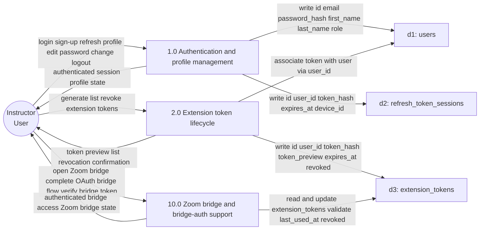

### Module B — Academic Management

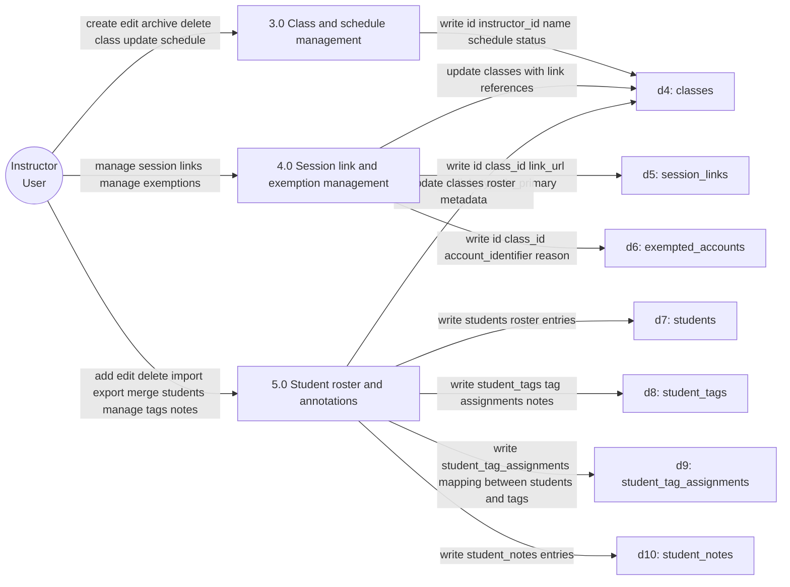

### Module C — Session & Participation

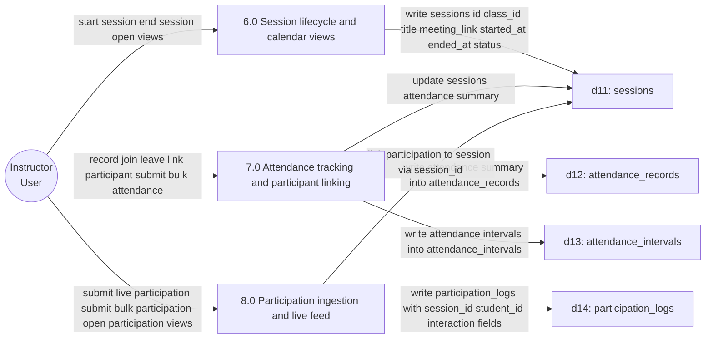

### Module D — Intelligence (Analytics & Reporting)

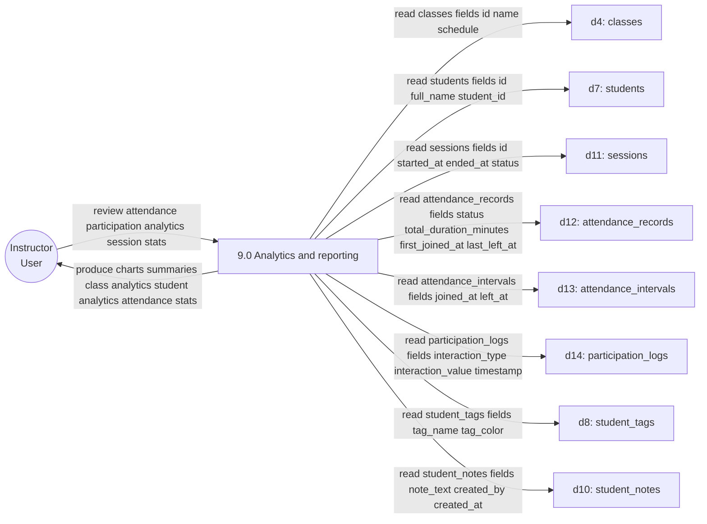

**Process and Data-Store Mapping**

| Process | Reads | Writes | Main instructor inputs | Main outputs |
|---|---|---|---|---|
| 1.0 Authentication and profile management | `users`, `refresh_token_sessions` | `users`, `refresh_token_sessions` | login, sign-up, refresh, profile edit, password change, logout | authenticated session, profile state, password-change confirmation |
| 2.0 Extension token lifecycle | `extension_tokens`, `users` | `extension_tokens` | generate token, list tokens, revoke token, revoke all | token preview list, revocation confirmation |
| 3.0 Class and schedule management | `classes` | `classes` | create/edit/archive/delete class, update schedule | class list, class detail, schedule-aware views |
| 4.0 Session link and exemption management | `session_links`, `exempted_accounts`, `classes` | `session_links`, `exempted_accounts` | manage meeting links, manage exemptions | updated link list, primary-link state, exemption list |
| 5.0 Student roster and annotations | `students`, `student_tags`, `student_tag_assignments`, `student_notes`, `classes` | `students`, `student_tags`, `student_tag_assignments`, `student_notes` | add/edit/delete/import/export/merge students, create from participant, manage tags, manage notes | roster updates, duplicate warnings, export file, link confirmation, tag state, note timeline |
| 6.0 Session lifecycle and calendar views | `sessions`, `classes` | `sessions` | start session from meeting, end session with timestamp, open active/history/detail/bundled/calendar/date-range views | active session record, ended session record, session history, calendar grouping |
| 7.0 Attendance tracking and participant linking | `attendance_records`, `attendance_intervals`, `sessions`, `students` | `attendance_records`, `attendance_intervals` | record join/leave, link participant to student, submit bulk attendance, open attendance views | attendance roster, interval history, duration totals, matched participant state |
| 8.0 Participation ingestion and live feed | `participation_logs`, `sessions`, `students` | `participation_logs` | submit live participation, submit bulk participation, open participation views | live feed updates, persisted participation log, recent activity |
| 9.0 Analytics and reporting | `classes`, `students`, `sessions`, `attendance_records`, `attendance_intervals`, `participation_logs`, `student_tags`, `student_notes` | none | review attendance, participation, analytics, session stats | charts, summaries, class analytics, student analytics, attendance stats |
| 10.0 Zoom bridge and bridge-auth support | `classes`, `sessions`, `extension_tokens` | `sessions`, `extension_tokens` | open Zoom bridge, complete OAuth bridge flow, verify bridge token context | authenticated bridge access, Zoom bridge state, Zoom session actions |

---

## A.3 User Program Flowchart

The program flowchart set illustrates the instructor's workflow through the ENGAGIUM system using binary decision points. It is split by area of concern.

### A.3.1 Auth and Recovery Flow

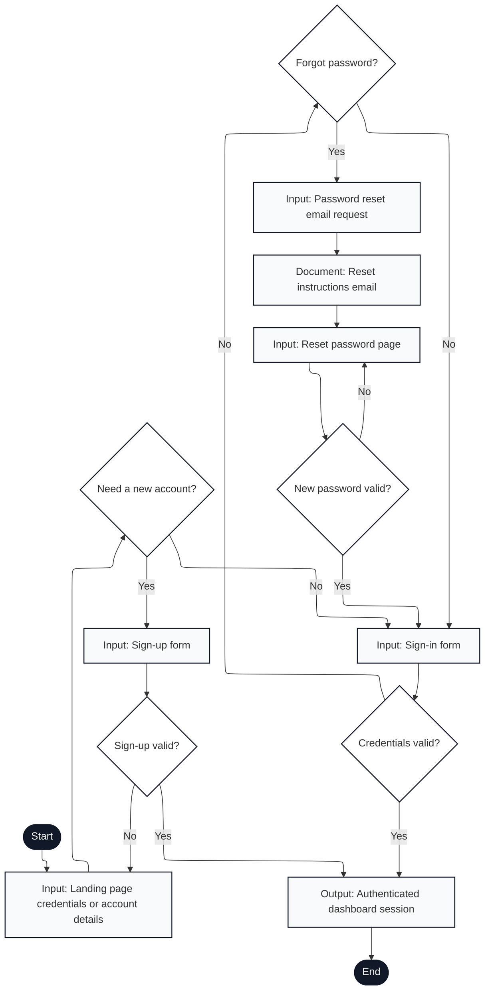

#### Flow Description

1. **Start**: User navigates to Engagium login page
2. **Landing Page**: Display login/sign-up interface with credential input fields
3. **Need a New Account?**: User decision point
   - **Yes** → Proceed to sign-up form
   - **No** → Proceed to sign-in form
4. **Sign-up Form**: Input email, password, first/last name
5. **Sign-up Valid?**: Backend validates new account credentials
   - **Yes** → Create user record, authenticate session
   - **No** → Return to landing page with error message
6. **Sign-in Form**: Input email and password
7. **Credentials Valid?**: Backend validates credentials against stored hash
   - **Yes** → Authenticate session, proceed to dashboard
   - **No** → Prompt password recovery or retry
8. **Forgot Password?**: User decision point
   - **Yes** → Request password reset
   - **No** → Return to sign-in form to retry
9. **Password Reset Email Request**: Submit email address to receive reset link
10. **Reset Instructions Email**: Output email document with secure reset link
11. **Reset Password Page**: Enter new password via secure token-validated form
12. **New Password Valid?**: Backend validates new password criteria
    - **Yes** → Save new password, return to sign-in
    - **No** → Return to reset page with validation feedback
13. **Authenticated Dashboard Session**: Output authenticated session token and redirect to dashboard
14. **End**: Login flow complete

#### Key Features Mapped

- **Account creation**: New professor sign-up with validation (lines 3-5)
- **Credential validation**: Secure password verification with error handling (lines 6-7)
- **Password recovery**: Email-based reset flow with token security (lines 8-12)
- **Session authentication**: JWT token generation and storage on successful login (line 13)

---

### A.3.2 Dashboard Hub and Navigation Flow

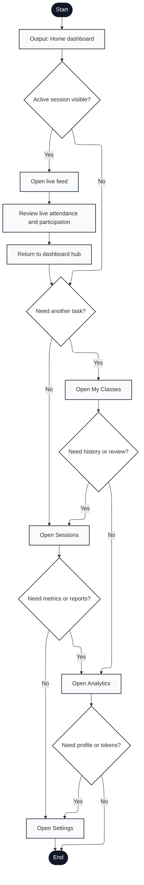

#### Flow Description

1. **Start**: User logs in or returns to dashboard
2. **Home Dashboard**: Output dashboard hub showing overview cards, quick actions, and navigation
3. **Active Session Visible?**: Check if a meeting is currently in progress
   - **Yes** → Display live session card with quick access to live feed
   - **No** → Show historical options
4. **Open Live Feed**: Display real-time attendance and participation monitoring interface (if active session)
5. **Review Live Attendance and Participation**: Monitor current meeting with live participant updates
6. **Return to Dashboard Hub**: Exit live feed view
7. **Need Another Task?**: User decision at hub (navigation choice)
   - **Yes** → Present area selection menu
   - **No** → Begin task selection chain
8. **Open My Classes**: Navigate to class management interface
9. **Need History or Review?**: User decision
   - **Yes** → Jump to Sessions area
   - **No** → Continue to Analytics
10. **Open Sessions**: Navigate to session history and session detail views
11. **Need Metrics or Reports?**: User decision
    - **Yes** → Jump to Analytics area
    - **No** → Continue to Settings
12. **Open Analytics**: Navigate to analytics dashboard with class-level metrics
13. **Need Profile or Tokens?**: User decision
    - **Yes** → Jump to Settings area
    - **No** → End flow
14. **Open Settings**: Navigate to profile, password, and extension token management
15. **End**: User exits dashboard or closes session

#### Key Features Mapped

- **Hub navigation**: Central dashboard with links to all major features (lines 2-14)
- **Active session quick access**: Live feed shortcut when meeting in progress (lines 3-5)
- **Sequential task navigation**: Chained decision points for browsing multiple areas (lines 8-13)
- **Non-blocking flow**: User can exit from any point or return to hub (line 6)

---

### A.3.3 Class and Roster Management Flow

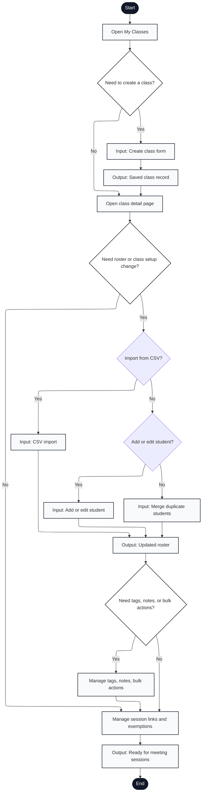

#### Flow Description

1. **Start**: User navigates to class management from dashboard
2. **Open My Classes**: Display list of professor's classes with options to create, edit, or archive
3. **Need to Create a Class?**: User decision
   - **Yes** → Class creation form
   - **No** → Skip to existing class detail
4. **Create Class Form**: Input class code, name, semester, section, institution
5. **Saved Class Record**: Output class record to database and receive class ID
6. **Open Class Detail Page**: Display class settings, roster, session history, links, and exemptions
7. **Need Roster or Class Setup Change?**: User decision
   - **Yes** → Proceed to roster import/edit/merge options
   - **No** → Skip to student organization
8. **Import from CSV?**: User choice for roster population method
   - **Yes** → CSV import workflow
   - **No** → Present manual add/edit/merge options
9. **CSV Import**: Input and parse CSV file with student names/IDs
10. **Add or Edit Student?**: User choice if not importing
    - **Yes** → Manual student add/edit form
    - **No** → Proceed to merge duplicates
11. **Input: Add or Edit Student**: Form to add individual student or update existing student record
12. **Input: Merge Duplicate Students**: Select duplicate student records and merge identities
13. **Output: Updated Roster**: Display new or modified roster with all students
14. **Need Tags, Notes, or Bulk Actions?**: User decision for advanced roster organization
    - **Yes** → Student organization interface
    - **No** → Skip to session link management
15. **Manage Tags, Notes, Bulk Actions**: Assign tags, add notes, bulk operations on student records
16. **Manage Session Links and Exemptions**: Link meeting URLs to automatic class detection, mark exempt students
17. **Output: Ready for Meeting Sessions**: Class and roster fully configured for attendance tracking
18. **End**: Class setup complete

#### Key Features Mapped

- **Class creation**: New class form with semester/section info (lines 3-5)
- **Roster import hierarchy**: Import (Yes) vs. manual entry chain (No) (lines 8-12)
- **Student organization**: Tags, notes, and bulk operations for roster management (line 15)
- **Session link mapping**: Link meeting URLs for automatic detection in extension (line 16)
- **Exemption handling**: Mark students exempt from attendance tracking (line 16)

---

### A.3.4 Session Monitoring and History Flow

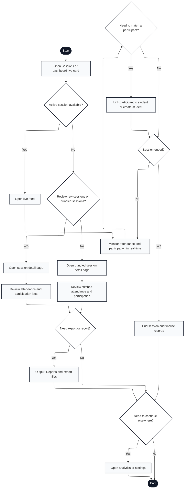

#### Flow Description

1. **Start**: User accesses session monitoring from dashboard or active live card
2. **Open Sessions or Dashboard Live Card**: Display session hub with active/past session list
3. **Active Session Available?**: Check if a meeting is currently in progress
   - **Yes** → Jump to live feed
   - **No** → Present history options
4. **Open Live Feed**: Display real-time monitoring interface with live participant updates (during active session)
5. **Monitor Attendance and Participation in Real Time**: Display current attendees, join/leave events, chat, reactions, hand raises, mic toggles
6. **Need to Match a Participant?**: User decision during session
   - **Yes** → Manual participant matching interface
   - **No** → Check if session has ended
7. **Link Participant to Student or Create Student**: Resolve unmatched participant names to student roster or create new student record
8. **Session Ended?**: Check if meeting is still active
   - **Yes** → Proceed to close session
   - **No** → Loop back to live monitoring (line 5)
9. **Review Raw Sessions or Bundled Sessions?**: User choice for history view
   - **Yes** → Raw session detail with individual sessions
   - **No** → Bundled view with stitched attendance
10. **Open Session Detail Page**: Display single session with attendance roster and participation logs
11. **Open Bundled Session Detail Page**: Display merged view across multiple sessions (e.g., all sessions from one class in a day)
12. **Review Attendance and Participation Logs**: Display detailed attendance status and engagement activity from raw session
13. **Review Stitched Attendance and Participation**: Display merged attendance and engagement from bundled sessions
14. **Need Export or Report?**: User decision
    - **Yes** → Generate and download export
    - **No** → Check for next action
15. **End Session and Finalize Records**: Close active session, calculate final attendance, submit data
16. **Output: Reports and Export Files**: Generate CSV/PDF exports with attendance records
17. **Need to Continue Elsewhere?**: User decision
    - **Yes** → Jump to Analytics or Settings
    - **No** → Exit
18. **Open Analytics or Settings**: Navigate to other areas from session context
19. **End**: Session monitoring complete

#### Key Features Mapped

- **Live monitoring**: Real-time participant tracking with engagement events (lines 4-8)
- **Manual matching**: Link unmatched participants to roster during session (line 7)
- **Session history**: Raw vs. bundled views for historical analysis (lines 9-13)
- **Export workflow**: Generate reports on demand (lines 14, 16)
- **Flexible navigation**: Can exit to analytics or settings without re-entering main flow (line 17)

---

### A.3.5 Analytics and Review Flow

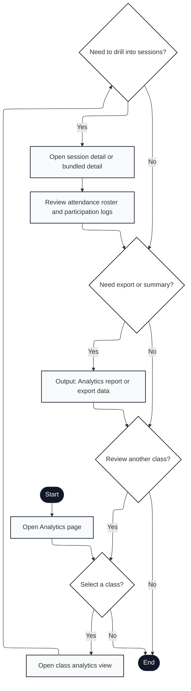

#### Flow Description

1. **Start**: User navigates to Analytics from dashboard or session context
2. **Open Analytics Page**: Display analytics hub with class selector and summary metrics
3. **Select a Class?**: User decision
   - **Yes** → Proceed to class-level analytics
   - **No** → Exit analytics (line 19)
4. **Open Class Analytics View**: Display class-level metrics with attendance trends, participation patterns, and session summary
5. **Need to Drill Into Sessions?**: User decision for detail level
   - **Yes** → Open detailed session views
   - **No** → Skip to export decision
6. **Open Session Detail or Bundled Detail**: Display individual session records or bundled session view (multiple sessions merged)
7. **Review Attendance Roster and Participation Logs**: Display detailed attendance records and engagement activity for selected session(s)
8. **Need Export or Summary?**: User decision
   - **Yes** → Generate export document
   - **No** → Check for additional class review
9. **Output: Analytics Report or Export Data**: Generate and output CSV/PDF report with attendance and participation data
10. **Review Another Class?**: User decision
    - **Yes** → Return to class selection
    - **No** → Exit analytics
11. **End**: Analytics review complete

#### Key Features Mapped

- **Class-level aggregation**: Summary metrics and trends across all sessions in class (line 4)
- **Drill-down hierarchy**: Optional session-level detail view from class summary (lines 5-7)
- **Export generation**: On-demand report generation with attendance and participation (line 9)
- **Multi-class browsing**: Loop back to class selector for comparative analysis (line 10)

---

### A.3.6 Settings and Extension Token Flow

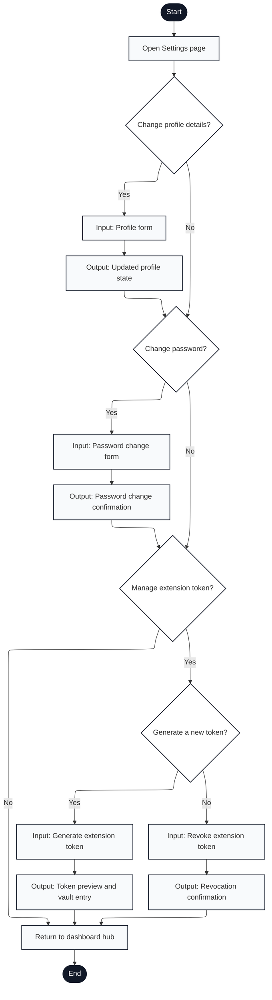

#### Flow Description

1. **Start**: User navigates to Settings from dashboard
2. **Open Settings Page**: Display settings interface with tabs/sections for profile, password, and extension tokens
3. **Change Profile Details?**: User decision
   - **Yes** → Open profile edit form
   - **No** → Skip to password change
4. **Profile Form**: Input form for name, email, institution, contact information
5. **Output: Updated Profile State**: Save profile changes to database and display confirmation
6. **Change Password?**: User decision
   - **Yes** → Open password change form
   - **No** → Skip to token management
7. **Password Change Form**: Input current password and new password with confirmation
8. **Output: Password Change Confirmation**: Hash and save new password, display success message
9. **Manage Extension Token?**: User decision for extension setup
   - **Yes** → Proceed to token actions
   - **No** → Return to dashboard
10. **Generate a New Token?**: User choice for token action
    - **Yes** → Generate new extension token
    - **No** → Proceed to revoke option
11. **Input: Generate Extension Token**: Create new cryptographic token tied to professor account
12. **Input: Revoke Extension Token**: Invalidate existing token(s) from database
13. **Output: Token Preview and Vault Entry**: Output token one-time display with copy-to-clipboard and vault entry instructions
14. **Output: Revocation Confirmation**: Display confirmation that token(s) have been revoked
15. **Return to Dashboard Hub**: Exit settings and return to main dashboard
16. **End**: Settings configuration complete

#### Key Features Mapped

- **Profile editing**: Updateable user information (lines 3-5)
- **Password management**: Secure password change with current password verification (lines 6-8)
- **Token generation**: Create new extension auth tokens (line 11)
- **Token revocation**: Invalidate compromised or unused tokens (line 12)
- **One-time token display**: Token shown once for vault/secure storage (line 13)

---

### A.3.7 Zoom Bridge and OAuth Flow

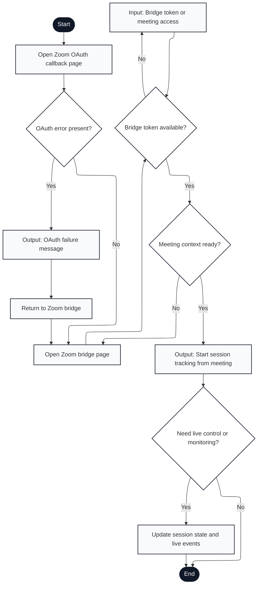

#### Flow Description

1. **Start**: User clicks Zoom OAuth authorization link or redirects from Zoom app
2. **Open Zoom OAuth Callback Page**: Backend receives OAuth code and processes authorization
3. **OAuth Error Present?**: Check for Zoom authorization errors (user denied, invalid scope, etc.)
   - **Yes** → Display error message
   - **No** → Proceed to bridge setup
4. **Output: OAuth Failure Message**: Display error details and link back to bridge
5. **Return to Zoom Bridge**: User clicks link or uses back button
6. **Open Zoom Bridge Page**: Display Zoom bridge interface with token input and meeting context setup
7. **Bridge Token Available?**: Check if bridge token for Zoom meeting context exists in session storage
   - **No** → Prompt for token entry
   - **Yes** → Skip to context readiness check
8. **Input: Bridge Token or Meeting Access**: Paste bridge token from Zoom meeting or enter meeting access code
9. **Meeting Context Ready?**: Check if meeting ID, participant list, and attendee context are available
    - **Yes** → Proceed to start tracking
    - **No** → Return to bridge page for additional input
10. **Output: Start Session Tracking from Meeting**: Create session record linked to Zoom meeting, display tracking interface
11. **Need Live Control or Monitoring?**: User decision
    - **Yes** → Enable live session updates and event processing
    - **No** → End bridge flow
12. **Update Session State and Live Events**: Process Zoom participant events (join/leave), engagement signals, and sync to Engagium database
13. **End**: Zoom bridge flow complete or user disconnects

#### Key Features Mapped

- **OAuth authorization**: Zoom app integration with permission scope handling (lines 1-4)
- **Error handling**: Graceful error display with recovery path (lines 3-5)
- **Bridge token validation**: Meeting context security via bridge token (lines 7-8)
- **Live event sync**: Real-time Zoom participant and engagement data processing (line 12)
- **Stateful flow**: Token persistence across bridge page interactions (line 7)

---

### A.3.8 Chrome Extension Meeting Tracking Flow

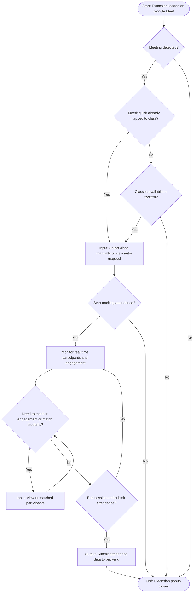

#### Flow Description

1. **Start**: Extension activates when professor opens Google Meet (manifest.json content script triggers)
2. **Meeting Detected?**: Extension's content script detects Google Meet DOM
   - **Yes** → Check if meeting was previously tracked
   - **No** → Wait or close extension (stop)
3. **Meeting Link Already Mapped?**: Check if this meeting URL was saved from previous session
   - **Yes** → Proceed to class selection with pre-selected class
   - **No** → Check for available classes
4. **Classes Available?**: Query backend for professor's active classes
   - **Yes** → Proceed to manual selection
   - **No** → Error message, dismiss extension (stop)
5. **Select Class**: Display class selector UI (auto-populated if mapped, manual dropdown if not)
   - Input: Professor selects class from dropdown or accepts auto-mapped suggestion
6. **Start Tracking?**: User clicks "Start Tracking" button
   - **Yes** → Create session, show monitoring interface
   - **No** → Dismiss meeting detection UI (stop)
7. **Session Monitor**: Display real-time tracking interface with:
   - Session duration timer
   - Total participant count
   - Matched students count
   - Unmatched/pending students list
8. **Need to Monitor Engagement?**: During active session, professor can check participants or match students
   - **Yes** → View unmatched participants, manually verify matches
   - **No** → Proceed to end session
9. **Manual Match Students** (loop): Professor can view unmatched participants and verify identity matches
   - Returns to engagement check until ready to end
10. **End Session?**: User clicks "End Tracking" button when meeting ends
    - **Yes** → Submit attendance data to backend
    - **No** → Continue monitoring (loop back to engagement check)
11. **Submit Data**: Output attendance records with matched/unmatched status to backend
12. **Stop**: Extension popup closes or loses focus

#### Key Features Mapped

- **Auto-mapping**: Meeting links remembered from previous sessions (lines 3-4)
- **Real-time sync**: Participants join/leave updates during session (line 8)
- **Unmatched handling**: Students without class roster matches viewable (line 9)
- **Error handling**: Graceful stop when no classes or meeting detection fails (lines 3, 6)
- **Session persistence**: Backend synchronization on end session (line 11)

---

---

## A.4 Visual Table of Contents (VTOC) Diagram

The VTOC diagram presents an updated module hierarchy mapped to current implementation.

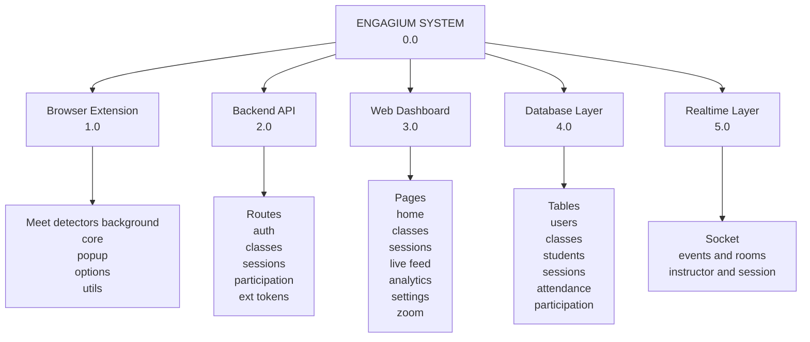

**Module Hierarchy Summary**

| Level 0 | Level 1 | Level 2 | Description |
|---------|---------|---------|-------------|
| 0.0 Engagium System | 1.0 Browser Extension | Detection/Core/DOM/UI modules + background runtime | Google Meet event capture and meeting-side submission |
| 0.0 Engagium System | 2.0 Backend API | Auth, classes, sessions, participation, extension-token routes/controllers | Business logic, persistence, and auth enforcement |
| 0.0 Engagium System | 3.0 Web Dashboard | Public auth pages, protected `/app/*` pages, zoom bridge pages | Instructor-facing management, monitoring, analytics |
| 0.0 Engagium System | 4.0 Database Layer | Auth, class, session, attendance, participation, tag/note tables | System of record |
| 0.0 Engagium System | 5.0 Realtime Layer | Socket handler + frontend WebSocket context | Live updates and room-based synchronization |

---

## A.5 Input-Process-Output (IPO) Diagram

The IPO diagram below includes a **Feedback** part (IPOF behavior) while keeping the section title as IPO Diagram.

The model reflects the implemented integration strategy in which Google Meet tracking is extension-based, Zoom support is bridge-based, session creation is meeting-driven, and realtime synchronization is delivered through instructor/session room communication.

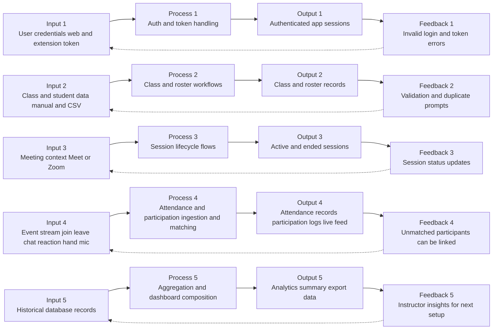

**IPO Summary (with Feedback)**

| Category | Input | Process | Output | Feedback |
|----------|-------|---------|--------|----------|
| Authentication | Email/password/JWT/extension token | Validate credentials and tokens | Authenticated session and API access | Error responses and token refresh prompts |
| Class/Roster Management | Class metadata and roster uploads | CRUD, import, dedupe, merge | Updated class/student/tag/note state | Validation results and conflict prompts |
| Session Lifecycle | Meeting URL/context + commands | Start, track status, end/finalize | Session records with timestamps/status | Live status messages and corrective actions |
| Attendance & Participation | Detected meeting events | Normalize, match, store, broadcast | Attendance intervals/records and participation logs | Unmatched participant linking and manual adjustments |
| Analytics | Stored attendance/participation/session data | Aggregate by class/session/student | Dashboard metrics and report/export data | Instructor decisions for next sessions and roster updates/participant linking |

